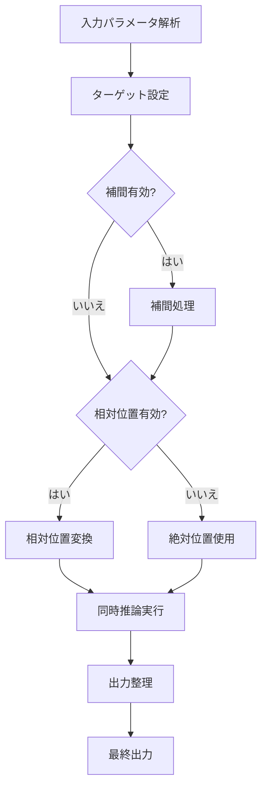

# マルチフレーム推論モード (`--multi_frame_inference`) 詳細ガイド

## 1. 導入部

### 1.1 概要

`fpack_generate_video.py` スクリプトの `--multi_frame_inference` 引数は、FramePack アーキテクチャの高度な機能を活用したマルチフレーム同時推論モードを提供します。このモードは、動画内の複数フレームを同時に生成・制御することを可能にし、従来のセクション単位の生成とは異なるアプローチを実現します。

### 1.2 技術的な位置づけ

マルチフレーム推論は、FramePackの同時推論アルゴリズムを基盤としており、以下の技術的特徴を持ちます：

- **同時生成**: 複数のターゲットフレームを1回の推論で生成
- **相対位置制御** (オプション): コントロールフレームを基準とした相対位置でフレームを制御
- **補間処理**: フレーム間のギャップを自動的に補間するオプション機能
- **メモリ最適化**: セクション単位生成と比較して効率的なメモリ使用

このモードは、FramePackのInverted Anti-driftingサンプリング方式を拡張し、複数フレームの同時制御を実現しています。

## 2. 技術概要

### 2.1 アルゴリズム概要

マルチフレーム推論のコアアルゴリズムは以下のステップで構成されます：

1. **入力解析**: ターゲットインデックスとコントロールインデックスのパース
2. **ターゲット設定**: ターゲットフレームの設定
3. **補間処理** (オプション): ターゲットインデックス間の距離が一定以上にならないよう、自動でインデックスを追加
4. **相対位置変換** (オプション): コントロールフレームを基準とした相対位置計算
5. **同時推論実行**: 複数のターゲットフレームを一度に生成
6. **出力整理**: 生成されたフレームを適切な順序で並べ替え



### 2.2 補間処理の仕組み

補間機能 (`enable_interpolation=true`) は、同時推論前にターゲットインデックス間の距離が一定以上にならないよう、自動でインデックスを追加する処理です：

- **インデックス追加**: ターゲットインデックス間のギャップを自動的に埋めるためのインデックスを挿入
- **閾値判定**: フレーム間隔が閾値を超える場合に補間ポイントを挿入
- **線形補間**: コントロールフレーム間の位置関係に基づく補間アルゴリズムでインデックスを計算
- **品質維持**: 補間フレームも同じ品質で生成

### 2.3 メモリ使用量とパフォーマンス

#### メモリ使用量の比較

| モード | メモリ使用量 | 説明 |
|--------|-------------|------|
| 通常FramePack | 中程度 | セクション単位でメモリ解放可能 |
| one_frame | 低 | 単一フレームのみ生成 |
| multi_frame | 高 | 複数フレーム同時生成 |

#### パフォーマンス特性

- **生成速度**: 同時推論により、個別生成より高速
- **メモリ効率**: 補間無効時は効率的、補間有効時は増加
- **品質安定性**: 同時制御により一貫性向上

## 3. 既存モードとの比較

### 3.1 one_frameモードとの比較

| 項目 | one_frame | multi_frame |
|------|-----------|-------------|
| 生成対象 | 単一フレーム | 複数フレーム |
| 制御方法 | ターゲットインデックス指定 | ターゲット/コントロールインデックス指定 |
| メモリ使用 | 低 | 中-高 |
| ユースケース | 画像編集、特定フレーム生成 | シーケンス制御、複数ポイント同時生成 |

#### 処理フロー比較

**one_frame処理フロー:**


**multi_frame処理フロー:**


### 3.2 通常FramePackとの比較

| 項目 | 通常FramePack | multi_frame |
|------|---------------|-------------|
| 生成単位 | セクション | 指定フレーム |
| 制御粒度 | セクション単位 | フレーム単位 |
| 柔軟性 | 中 | 高 |
| メモリ使用 | 段階的解放可能 | 一括使用 |

## 4. 実装詳細

### 4.1 内部処理の詳細

#### 相対位置変換（オプション）

```python
# コントロールフレームを基準とした相対位置計算（enable_relative_positioning=trueの場合）
if enable_relative_positioning:
    base_index = min(control_indices)
    relative_target_indices = [i - base_index for i in model_target_indices]
    relative_control_indices = [i - base_index for i in control_indices]
    logger.info(f"Relative positioning enabled. Base index: {base_index}")
    logger.info(f"Relative target indices: {relative_target_indices}")
    logger.info(f"Relative control indices: {relative_control_indices}")
else:
    # enable_relative_positioning=falseの場合、絶対インデックスを使用
    relative_target_indices = model_target_indices
    relative_control_indices = control_indices
    logger.info(f"Relative positioning disabled. Using absolute indices.")
```

この変換により、モデルはコントロールフレームからの相対的な位置関係を学習し、より正確な補間が可能になります。オプションで無効化可能で、デバッグ出力も提供されます。

##### 変換の計算式

相対位置変換の計算式は以下の通りです：

- **基準インデックス (base_index)**: `min(control_indices)`
- **相対ターゲットインデックス**: `relative_target_indices[i] = model_target_indices[i] - base_index`
- **相対コントロールインデックス**: `relative_control_indices[i] = control_indices[i] - base_index`

##### 具体的な変換例

以下に、相対位置変換の具体的な数値例を示します。複数のパターンを記載し、シンプルなものと複雑なものを含めています。

**例1: シンプルなケース（コントロールインデックスが0から始まる）**

- **入力**:
  - コントロールインデックス: [0, 10]
  - ターゲットインデックス: [5, 15]
- **計算**:
  - base_index = min([0, 10]) = 0
  - relative_target_indices = [5 - 0, 15 - 0] = [5, 15]
  - relative_control_indices = [0 - 0, 10 - 0] = [0, 10]
- **結果**: 相対位置変換により、コントロールフレーム0を基準とした相対位置が計算されます。

**例2: 複雑なケース（コントロールインデックスが中間位置）**

- **入力**:
  - コントロールインデックス: [10, 20]
  - ターゲットインデックス: [5, 25]
- **計算**:
  - base_index = min([10, 20]) = 10
  - relative_target_indices = [5 - 10, 25 - 10] = [-5, 15]
  - relative_control_indices = [10 - 10, 20 - 10] = [0, 10]
- **結果**: 負の相対位置（過去方向）も正しく処理され、コントロールフレーム10を基準とした位置関係が表現されます。

**例3: 複数コントロールフレームのケース**

- **入力**:
  - コントロールインデックス: [5, 15, 25]
  - ターゲットインデックス: [0, 10, 20, 30]
- **計算**:
  - base_index = min([5, 15, 25]) = 5
  - relative_target_indices = [0 - 5, 10 - 5, 20 - 5, 30 - 5] = [-5, 5, 15, 25]
  - relative_control_indices = [5 - 5, 15 - 5, 25 - 5] = [0, 10, 20]
- **結果**: 複数のコントロールフレームがある場合、最小のコントロールインデックスを基準として相対位置が計算されます。

これらの例からわかるように、相対位置変換はコントロールフレームを基準とした位置関係を明確にし、モデルの学習と補間精度を向上させます。特に、ターゲットフレームがコントロールフレームの前後にある場合に有効です。

#### 同時推論の実装

同時推論では、以下の処理が行われます：

1. **ノイズ生成**: 各ターゲットフレームに対して独立したノイズを生成
2. **条件付与**: コントロール画像のlatentとインデックスを条件として使用
3. **並列処理**: 複数のフレームを同時に処理
4. **出力統合**: 生成されたフレームを適切な順序で統合

#### 補間アルゴリズム

補間処理では、同時推論前に以下のロジックが適用され、ターゲットインデックスを追加します：

```python
# 補間ポイントの計算
# 過去方向と未来方向で異なる閾値を適用可能
threshold = threshold_past if start < min(control_indices) else threshold_future
if dist > threshold:
    num_segments = (dist + (threshold - 1)) // threshold
    points = np.linspace(start, end, num_segments + 1).round().astype(int)
    final_indices.extend(points[1:])
```

補間閾値は `--multi_frame_inference` パラメータ内で `interpolation_threshold` キーにより設定可能で、デフォルトは "2,3"（過去方向=2、未来方向=3）です。

### 4.2 パラメータの詳細仕様

#### モード固有パラメータ

| パラメータ | 型 | 必須 | 説明 |
|-----------|----|------|------|
| `target_indices` | string | はい | 生成対象フレームのインデックス（セミコロン区切り） |
| `control_index` | string | はい | コントロールフレームのインデックス |
| `enable_interpolation` | boolean | いいえ | 補間機能を有効化 |
| `save_interpolated` | boolean | いいえ | 補間フレームを保存 |
| `enable_relative_positioning` | boolean | いいえ | 相対位置変換を有効化（デフォルト: false） |

#### 補助パラメータ

| パラメータ | 説明 |
|-----------|------|
| `no_2x` | 補助参照情報（clean_latents_2x）の使用を無効化 |
| `no_4x` | 補助参照情報（clean_latents_4x）の使用を無効化 |
| `randomize_latent` | 参照画像の影響を排除 |

#### モード固有パラメータ（追加）

| パラメータ | 型 | デフォルト | 説明 |
|-----------|----|-----------|------|
| `interpolation_threshold` | string | "2,3" | 補間処理時のインデックス追加閾値（過去方向,未来方向） |

## 5. 使用例

### 5.1 基本的な複数フレーム生成

```bash
python fpack_generate_video.py \
  --prompt "a cat running on the grass" \
  --multi_frame_inference "target_indices=0;15,control_index=0,control_image=./cat.png,enable_relative_positioning=true"
```

**技術的文脈:**
- フレーム0と15を同時生成
- コントロール画像をフレーム0に適用
- 補間なしの直接生成

### 5.2 中間フレームの補間

```bash
python fpack_generate_video.py \
  --prompt "a cat running on the grass" \
  --multi_frame_inference "target_indices=0;23,control_index=0,control_image=./cat.png,enable_interpolation=true,save_interpolated=true,enable_relative_positioning=true"
```

**技術的文脈:**
- フレーム0と23の間に自動補間
- 補間フレームも保存
- メモリ使用量が増加

### 5.3 参照画像の影響排除

```bash
python fpack_generate_video.py \
  --prompt "a dog swimming in the ocean" \
  --multi_frame_inference "target_indices=0;23,control_index=0,control_image=./cat.png,randomize_latent=true,enable_relative_positioning=true"
```

**技術的文脈:**
- コントロール画像の構造的影響を最小化
- プロンプト忠実性を優先
- より創造的な生成結果

### 5.4 補間閾値のカスタマイズ

```bash
python fpack_generate_video.py \
  --prompt "a cat running on the grass" \
  --multi_frame_inference "target_indices=0;23,control_index=0,control_image=./cat.png,enable_interpolation=true,interpolation_threshold=1,4,enable_relative_positioning=true"
```

**技術的文脈:**
- 過去方向の閾値を1、未来方向の閾値を4に設定
- より細かい補間（過去方向）または粗い補間（未来方向）を可能に
- シーンの複雑さに応じた調整が可能

## 6. ベストプラクティス

### 6.1 パフォーマンス最適化

1. **メモリ管理**: 大規模生成時は `no_2x`, `no_4x` を検討
2. **補間使用**: 必要な場合のみ有効化（メモリ節約）
3. **バッチ処理**: 複数プロンプトは別実行を推奨

### 6.2 品質向上のTips

1. **コントロール画像選択**: 高品質な参照画像を使用
2. **インデックス設定**: コントロールとターゲットの間隔を適切に設定
3. **相対位置制御**: `enable_relative_positioning=true` でコントロールフレームからの相対位置を有効化
4. **補間閾値調整**: `--multi_frame_inference` パラメータ内で `interpolation_threshold` を設定して過去/未来方向の閾値を個別に設定
   - 小さい値（例: 1）: 細かい補間、滑らかな遷移
   - 大きい値（例: 5）: 粗い補間、メモリ節約
   - 非対称設定: 過去方向を細かく、未来方向を粗くするなど

### 6.3 トラブルシューティング

- **メモリ不足**: `no_2x=true,no_4x=true` を追加
- **品質低下**: `randomize_latent=false` を確認
- **補間失敗**: コントロールインデックスがターゲットより小さいことを確認
- **位置制御の問題**: `enable_relative_positioning=true` で相対位置変換を有効化

### 6.4 推奨設定

| ユースケース | 推奨設定 |
|-------------|----------|
| 高品質生成 | `enable_interpolation=true,save_interpolated=true,enable_relative_positioning=true` |
| 高速生成 | `no_2x=true,no_4x=true,enable_interpolation=false,enable_relative_positioning=false` |
| 創造性重視 | `randomize_latent=true,enable_relative_positioning=true` |
| 細かい補間 | `interpolation_threshold=1,1,enable_relative_positioning=true` |
| メモリ節約 | `interpolation_threshold=5,5,enable_relative_positioning=false` |

このドキュメントは、技術的な詳細を重視しつつ、実用的な使用例を保持しています。マルチフレーム推論の理解と効果的な活用に役立ててください。