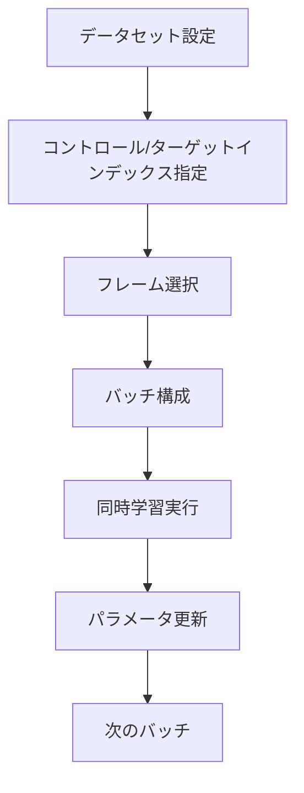

# マルチフレーム学習モード (`--multi_frame_training`) 詳細ガイド

## 1. 導入部

### 1.1 概要

`fpack_train_network.py` スクリプトの `--multi_frame_training` 引数は、FramePack アーキテクチャの高度な機能を活用したマルチフレーム同時学習モードを提供します。このモードは、動画内の複数フレームを同時に学習・制御することを可能にし、従来の単一フレーム学習とは異なるアプローチを実現します。

### 1.2 技術的な位置づけ

マルチフレーム学習は、FramePackの同時学習アルゴリズムを基盤としており、以下の技術的特徴を持ちます：

- **同時学習**: 複数のターゲットフレームを1回の学習ステップで処理
- **相対位置制御** (オプション): コントロールフレームを基準とした相対位置でフレームを制御
- **柔軟なデータセット構成**: コントロールフレームとターゲットフレームの自由な組み合わせ
- **メモリ最適化**: 効率的なバッチ処理によるメモリ使用

このモードは、FramePackの学習プロセスを拡張し、複数フレームの同時制御を実現しています。

## 2. 技術概要

### 2.1 アルゴリズム概要

マルチフレーム学習のコアアルゴリズムは以下のステップで構成されます：

1. **データセット解析**: コントロールインデックスとターゲットインデックスの設定
2. **フレーム選択**: 学習対象となるコントロールとターゲットフレームの決定
3. **バッチ構成**: 複数フレームの同時処理のためのデータ構造構築
4. **同時学習実行**: 複数のターゲットフレームを一度に学習



### 2.2 コントロールフレームとターゲットフレーム

- **コントロールフレーム**: 学習の基準となるフレーム。条件付け情報として使用
- **ターゲットフレーム**: 学習対象となるフレーム。生成・予測の対象

### 2.3 メモリ使用量とパフォーマンス

#### メモリ使用量の比較

| モード | メモリ使用量 | 説明 |
|--------|-------------|------|
| 通常FramePack | 中程度 | セクション単位でメモリ解放可能 |
| multi_frame | 高 | 複数フレーム同時処理 |

#### パフォーマンス特性

- **学習速度**: 同時処理により効率的
- **メモリ効率**: バッチサイズによる調整可能
- **品質安定性**: 同時制御により一貫性向上

## 3. データセットTOML設定

### 3.1 [general]セクションの設定

マルチフレーム学習では、基本的な設定を `[general]` セクションで行います：

```toml
[general]
resolution = [512, 512]          # 解像度設定
batch_size = 1                   # バッチサイズ
caption_extension = ".txt"       # キャプション拡張子
enable_bucket = false            # バケット有効化
bucket_no_upscale = false        # アップスケール無効
num_repeats = 10                 # データ繰り返し回数
cache_latents = true             # 潜在キャッシュ有効化
cached_latents_dir = "path/to/cache"  # キャッシュディレクトリ
```

### 3.2 [[datasets]]セクションの設定

データセット固有の設定を `[[datasets]]` セクションで行います：

#### 基本設定

```toml
[[datasets]]
image_directory = "path/to/images"           # 画像ディレクトリ
dataset_type = "grouped_image"               # データセットタイプ
control_image_dir = "path/to/controls"       # コントロール画像ディレクトリ
control_indices = [3]                        # コントロールフレームインデックス
target_indices = [1, 5]                      # ターゲットフレームインデックス
enable_relative_positioning = true           # 相対位置制御有効化
fp_1f_no_post = true                         # 後処理無効化
fp_latent_window_size = 5                    # 潜在ウィンドウサイズ
```

#### 主要パラメータの説明

| パラメータ | 型 | 必須 | 説明 |
|-----------|----|------|------|
| `control_indices` | array | はい | コントロールフレームのインデックス（基準フレーム） |
| `target_indices` | array | はい | ターゲットフレームのインデックス（学習対象） |
| `fp_latent_window_size` | int | いいえ | FramePackの潜在ウィンドウサイズ（デフォルト: 9） |
| `fp_1f_no_post` | bool | いいえ | 後処理フレームの追加を無効化 |

#### ファイル命名規則とインデックスの対応関係

マルチフレーム学習では、画像ファイルの命名規則が重要です。`GroupedImageDirectoryDatasource` を使用する場合：

**ファイル命名規則:**
```
{prefix}_{index:04d}.{ext}
例: cat_0000.png, cat_0001.png, cat_0002.png, ...
```

**インデックスとファイルの対応:**
- `index = 0` → `cat_0000.png`
- `index = 1` → `cat_0001.png`
- `index = 5` → `cat_0005.png`

#### コントロールインデックスとターゲットインデックスの設定例

**例1: シンプルなケース**
```toml
control_indices = [0]
target_indices = [5, 10]
```
- コントロール: `*_0000.png` (基準フレーム)
- ターゲット: `*_0005.png`, `*_0010.png` (学習対象フレーム)

**例2: 複数コントロールフレーム**
```toml
control_indices = [0, 10]
target_indices = [5, 15, 20]
```
- コントロール: `*_0000.png`, `*_0010.png` (基準フレーム)
- ターゲット: `*_0005.png`, `*_0015.png`, `*_0020.png` (学習対象フレーム)

#### 注意点

- インデックスは0から始まる連番であること
- すべてのグループで同じインデックス範囲のファイルが存在すること
- コントロールインデックスとターゲットインデックスが重複しても問題なく学習可能（例: control_indices = [3], target_indices = [1, 3, 5]）

### 3.3 相対位置制御 (enable_relative_positioning)

マルチフレーム学習では、オプションで相対位置制御を有効化できます。この機能は、コントロールフレームを基準とした相対位置でフレームを制御します。

#### 設定方法

```toml
[[datasets]]
# ... 他の設定 ...
enable_relative_positioning = true  # 相対位置制御を有効化
```

#### 相対位置変換の仕組み

相対位置制御が有効な場合：

1. **基準インデックス決定**: `min(control_indices)` を基準とする
2. **相対位置計算**: 各フレームのインデックスから基準を引く
3. **学習データの変換**: モデルが相対位置関係を学習

##### 計算式

```
base_index = min(control_indices)
relative_target_indices[i] = target_indices[i] - base_index
relative_control_indices[i] = control_indices[i] - base_index
```

##### 具体例

**入力設定:**
```toml
control_indices = [5, 15]
target_indices = [0, 10, 20, 25]
enable_relative_positioning = true
```

**変換結果:**
- base_index = 5
- relative_control_indices = [0, 10] (5-5=0, 15-5=10)
- relative_target_indices = [-5, 5, 15, 20] (0-5=-5, 10-5=5, 20-5=15, 25-5=20)

#### 使用時の利点

- **柔軟な位置制御**: コントロールフレームの絶対位置に依存しない
- **汎化性能向上**: 相対的な位置関係を学習
- **シーケンス理解**: フレーム間の時間的関係をより良く学習

#### 注意事項

- デフォルトは `false`（無効）
- 有効化すると学習の複雑さが増す
- コントロールフレームが複数ある場合に特に有効

#### VideoDatasetでのマルチフレーム学習

VideoDatasetを使用する場合、コマンドラインで `--multi_frame_training` パラメータを指定します：

```bash
--multi_frame_training "num_control_frames=1,max_target_frames=4,max_frame_distance=32"
```

#### VideoDatasetパラメータ

| パラメータ | 説明 |
|-----------|------|
| `num_control_frames` | コントロールフレームの数 |
| `max_target_frames` | 最大ターゲットフレーム数 |
| `max_frame_distance` | コントロールからの最大距離 |
| `enable_multi_control` | 複数コントロールフレームの使用を有効化 |

#### enable_multi_control_frame_trainingオプション

`--enable_multi_control_frame_training` オプションを使用すると、データセットのメタデータで指定された `control_indices` を使用して複数コントロールフレームを扱うことができます：

```bash
python fpack_train_network.py \
  # ... 基本設定 ...
  --multi_frame_training "num_control_frames=2,max_target_frames=4,max_frame_distance=32" \
  --enable_multi_control_frame_training
```

このオプションが有効な場合：
- データセットの `control_indices` が使用される
- 指定されたコントロールフレームからの相対位置でターゲットフレームが選択される
- より制御されたマルチフレーム学習が可能

#### VideoDatasetでの動作フロー

1. **コントロールフレーム選択**: `enable_multi_control` が有効な場合、メタデータから `control_indices` を取得、無効な場合はランダムに1つ選択
2. **ターゲットフレーム選択**: コントロールフレームからの `max_frame_distance` 以内でランダムに `max_target_frames` 個選択
3. **データ構造構築**: コントロールとターゲットフレームのペアを作成
4. **学習実行**: 同時学習を実行

## 4. 学習実行

このセクションでは、コマンドラインでマルチフレーム学習を有効にする方法に焦点を当てます。学習率やオプティマイザなどの一般的な学習設定ではなく、`--multi_frame_training` 引数の使用方法を具体的に示します。

```bash
# VideoDatasetでマルチフレーム学習を有効にするコマンド例
# 学習率やオプティマイザなどの詳細なパラメータは、ご自身の環境や目的に合わせて調整してください。
# 設定の全体像については、セクション5のTOMLファイル例が参考になります。
accelerate launch --num_cpu_threads_per_process 1 fpack_train_network.py \
  --dataset_config_file "dataset_config.toml" \
  --pretrained_model_name_or_path "/path/to/your/model" \
  --output_dir "/path/to/output" \
  --multi_frame_training "num_control_frames=1,max_target_frames=4,max_frame_distance=32"
```

## 5. TOMLファイルを使用した学習実行

コマンドラインで多くの引数を指定する代わりに、設定ファイル（TOML）で学習全体を管理することもできます。以下に、マルチフレーム学習を行うための**完全な設定ファイルの実例**を示します。このファイルをベースに、ご自身の環境や目的に合わせて各パラメータを調整してください。

### 5.1 TOML設定ファイルの例

```toml
# モデル関連の設定
[model]
dit = "path/to/dit_model.safetensors"
vae = "path/to/vae.safetensors"
text_encoder1 = "path/to/text_encoder1.safetensors"
text_encoder2 = "path/to/text_encoder2.safetensors"
image_encoder = "path/to/image_encoder.safetensors"
network_module = "networks.lora_framepack"
network_dim = 16
split_attn = true
fp8_base = true
fp8_scaled = true
blocks_to_swap = 24
fp8_llm = true

# オプティマイザ関連の設定
[optimizer]
optimizer_type = "adamw8bit"
learning_rate = 5.0e-4

# データセット関連の設定
[dataset]
dataset_config = "dataset_config.toml"

# トレーニング全般の設定
[training]
mixed_precision = "bf16"
sdpa = true
xformers = true
gradient_accumulation_steps = 2
gradient_checkpointing = true
timestep_sampling = "shift"
weighting_scheme = "none"
max_data_loader_n_workers = 2
persistent_data_loader_workers = true
max_train_steps = 5000
save_every_n_steps = 100
seed = 42
enable_multi_control_frame_training = true
output_dir = "./train_LoRA"
output_name = "my_lora_model"
logging_dir = "logs"
vae_chunk_size = 512
vae_spatial_tile_sample_min_size = 512
```

### 5.2 実行コマンドの例

```bash
accelerate launch --num_cpu_threads_per_process 1 --mixed_precision bf16 fpack_train_network.py --config_file "train_config.toml"
```

### 5.3 この方法の利点

この方法では、学習の設定をTOMLファイルで一元管理できるため、以下の利点があります：


- **設定の再利用性**: 同じ設定ファイルを複数の学習実行で使用可能
- **設定のバージョン管理**: TOMLファイルをGitなどで管理しやすく、変更履歴を追跡可能
- **可読性の向上**: コマンドライン引数よりも構造化された形式で設定を記述
- **エラーの削減**: 設定ミスを減らし、学習の安定性を向上


## 6. ベストプラクティス

### 6.1 データセット構成

マルチフレーム学習の成功は、質の高いデータセット構成に大きく依存します。

- **コントロールフレームの選択**: 動画やシーケンスの主要な特徴を最もよく表す、高品質なフレームをコントロールフレームとして選択することが重要です。
- **ターゲットフレームの関連性**: ターゲットフレームは、コントロールフレームと文脈的に関連性が高いものを選択してください。
- **インデックス間隔**: コントロールフレームとターゲットフレームの間隔が広すぎると、モデルが関係性を学習するのが難しくなる場合があります。データセットの特性に合わせて適切な間隔を設定してください。
- **データバランス**: 特定のフレームペアに偏りすぎないよう、データセット全体のバランスを考慮することが望ましいです。

### 6.2 パフォーマンス最適化

学習プロセスを効率化するためには、以下の設定が有効です。

- **バッチサイズ**: ご利用のハードウェア（特にVRAM容量）に応じて、可能な範囲で大きいバッチサイズを設定すると学習が高速化します。メモリが不足する場合は、`gradient_accumulation_steps`と組み合わせて調整してください。
- **キャッシュ活用**: `cache_latents = true` を有効にすることで、データ読み込みのボトルネックを解消し、学習を大幅に高速化できます。
- **FP8最適化**: 対応するハードウェアでは、`--fp8_scaled` や `--fp8_llm` といったオプションを使用することで、メモリ使用量を削減しつつ学習速度を向上させることができます。
- **勾配チェックポイント**: `--gradient_checkpointing` を有効にすると、メモリ使用量を大幅に削減できるため、より大きなモデルやバッチサイズでの学習が可能になります。

### 6.3 品質向上

最終的な生成品質を高めるためには、以下の概念的なアプローチが推奨されます。

- **データセットの品質**: 最も重要な要素は、高品質で多様性に富んだデータセットを用意することです。ノイズの多い画像や、内容が不適切なデータは学習の妨げになります。
- **段階的な学習**: 最初はシンプルな設定（低解像度、小さなネットワーク次元など）で学習を開始し、モデルが基本的な関係性を捉えられたことを確認してから、徐々に設定を複雑にしていくアプローチが有効です。
- **定期的なサンプリング**: 学習の進捗を定期的にサンプリング（画像生成）して確認することは、問題の早期発見やハイパーパラメータ調整の指針を得る上で非常に重要です。

### 6.4 推奨設定について

どのような設定が最適かは、使用するデータセットの特性、学習の目的（特定のスタイルを学ぶのか、汎用的な動きを学ぶのかなど）、利用可能な計算リソースによって大きく異なります。

このドキュメントのセクション5で示したTOML設定例は、あくまで出発点としての一例です。まずはこの設定をベースとし、ご自身の目的に合わせて各パラメータ（学習率、ネットワーク次元、オプティマイザなど）を実験的に調整していくことを強く推奨します。最適な設定を見つけるためには、試行錯誤が不可欠です。

## 7. トラブルシューティング

### 6.1 よくある問題と解決法

#### メモリ不足エラー

**問題**: CUDA out of memory エラー
**解決法**:
- バッチサイズを1に減らす
- `--gradient_accumulation_steps` を増やす
- `--fp8_scaled --fp8_llm` を有効化
- 解像度を下げる

#### 学習が不安定

**問題**: 損失が発散する
**解決法**:
- 学習率を下げる（1e-5程度）
- `--lr_warmup_steps` を増やす
- ネットワーク次元を小さくする

#### キャッシュ生成が失敗

**問題**: キャッシュファイルが生成されない
**解決法**:
- `cached_latents_dir` が正しいパスか確認
- ディスク容量が十分か確認
- `--batch_size` を小さくする

#### コントロール/ターゲットインデックスエラー

**問題**: IndexError または範囲外エラー
**解決法**:
- 画像グループのフレーム数がインデックスを超えていないか確認
- `control_indices` と `target_indices` が有効な範囲内か確認

#### 学習精度が低い

**問題**: 生成品質が期待通りでない
**解決法**:
- データセットの品質を確認
- コントロールフレームの選択を見直す
- 学習ステップ数を増やす
- ネットワークパラメータを調整

### 6.2 デバッグTips

1. **ログ確認**: 学習ログでエラーメッセージを確認
2. **サンプル生成**: 定期的にサンプルを生成して進捗を確認
3. **バッチ内容確認**: デバッグモードでバッチ内容を確認
4. **メモリ監視**: GPUメモリ使用量を監視

### 6.3 サポートリソース

- FramePack公式ドキュメント
- GitHub Issuesでの類似問題検索
- コミュニティフォーラムでの議論

このドキュメントは、技術的な詳細を重視しつつ、実用的な使用例を保持しています。マルチフレーム学習の理解と効果的な活用に役立ててください。